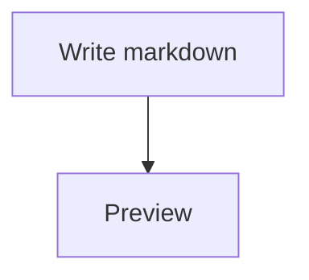
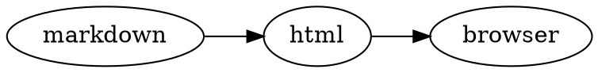
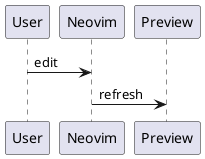

Diagrams are code blocks named after the diagram language. All of them are
drawn in the browser without a network connection, except PlantUML.

| Fence                          | Drawn by                                                        | Options               |
| ------------------------------ | --------------------------------------------------------------- | --------------------- |
| `mermaid`                      | [Mermaid](https://mermaid.js.org)                               | `maid`                |
| `chart`                        | [Chart.js 4](https://www.chartjs.org)                           |                       |
| `dot` or `graphviz`            | [Graphviz](https://graphviz.org) (viz.js)                       |                       |
| `plantuml`                     | a [PlantUML](https://plantuml.com) server                       | `uml`                 |
| `flowchart`                    | [flowchart.js](https://flowchart.js.org)                        | `flowchart_diagrams`  |
| `sequence-diagrams`            | [js-sequence-diagrams](https://bramp.github.io/js-sequence-diagrams) | `sequence_diagrams` |

The options are keys of `preview_options`, see the [configuration
reference](../configuration.mdx#preview-options). A diagram with an error shows
the error in its place; the rest of the page still renders.

## Mermaid

````markdown

````

A code block without a language is drawn as Mermaid too when its first line is
`graph <direction>`, `gantt`, `sequenceDiagram` or `erDiagram`.

Mermaid uses its dark theme when the page is dark. Other [Mermaid
options](https://mermaid.js.org/config/schema-docs/config.html) go in `maid`:

```lua
opts = {
  preview_options = {
    -- ELK lays out large, dense graphs more cleanly
    maid = { layout = "elk" },
  },
}
```

### Full-screen viewer

Hover a Mermaid diagram and click the button in its top-right corner to open it
full screen:

| Action          | How                                  |
| --------------- | ------------------------------------ |
| Zoom            | mouse wheel, or `+` and `-`          |
| Pan             | drag                                 |
| Fit to screen   | `0`                                  |
| Download as SVG | the download button                  |
| Close           | `Esc`, or the close button           |

### While you type

When an edit breaks a diagram, the page keeps showing its last good drawing,
dimmed, instead of an error, so the page doesn't jump while you type. A
diagram that has never drawn shows the error.

## Charts

A `chart` block holds a [Chart.js 4 configuration](https://www.chartjs.org/docs/latest/configuration/)
as JSON:

````markdown
```chart
{
  "type": "bar",
  "data": {
    "labels": ["Mon", "Tue", "Wed"],
    "datasets": [{ "label": "Notes", "data": [3, 5, 2] }]
  }
}
```
````

Configurations written for Chart.js 2 need the [migration to
v3](https://www.chartjs.org/docs/latest/migration/v3-migration.html) and
later.

## Graphviz

````markdown

````

## PlantUML

````markdown

````

Bare `@startuml` ... `@enduml` blocks work too, without a fence.

PlantUML diagrams are drawn by a PlantUML server, `https://www.plantuml.com`
by default, which sees the diagram's source. To use your own server, or SVG
images:

```lua
opts = {
  preview_options = {
    uml = { server = "http://localhost:8080", imageFormat = "svg" },
  },
}
```

## flowchart.js

````markdown
```flowchart
st=>start: Start
op=>operation: Work
e=>end: End
st->op->e
```
````

## Sequence diagrams

````markdown
```sequence-diagrams
Alice->Bob: Hello
Bob-->Alice: Hi
```
````

They are drawn in the hand-drawn style; `sequence_diagrams = { theme =
"simple" }` draws straight lines.
