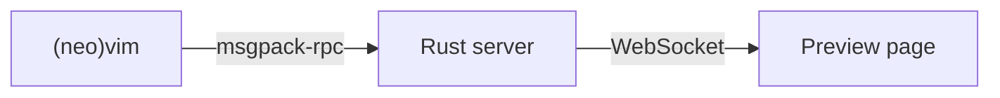
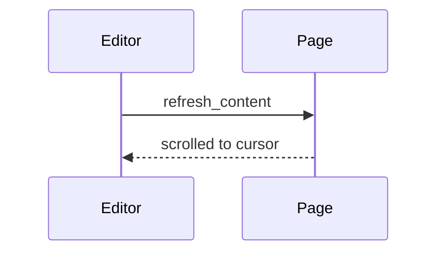
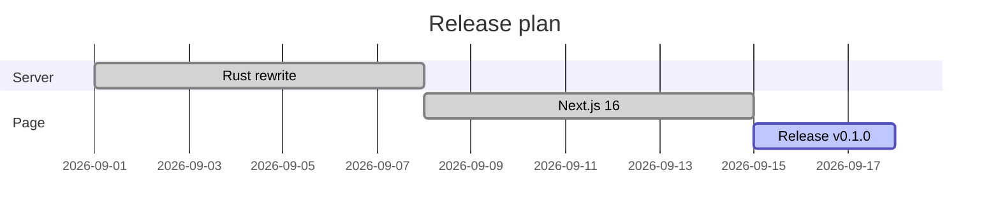
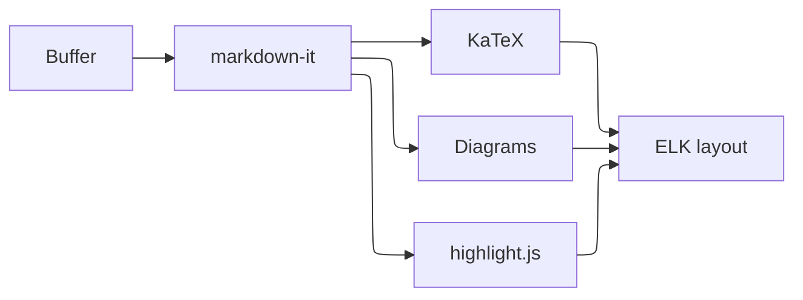
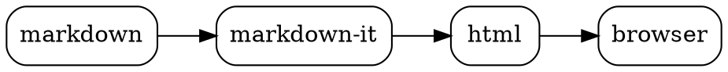
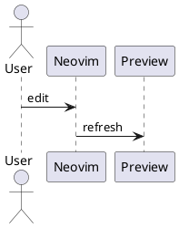

# Feature tour

Open this file and run `:MarkdownPreview`. Every section below shows one
feature of the preview; move the cursor around to watch the page follow it.

${toc}

## Text

Plain paragraphs with **bold**, *italic*, ~~strikethrough~~, `inline code`,
<kbd>Ctrl</kbd>+<kbd>C</kbd> and a [link](https://github.com/sammaji/markdown-preview.nvim).

Bare URLs are linked automatically: https://neovim.io

Typographer: "smart quotes", 'single quotes', en -- and em --- dashes, (c) (tm) and ellipsis...

> Blockquotes
>
> > can be nested.

Headings get anchor links: hover a heading and click the link icon on its left.

## GitHub alerts

> [!NOTE]
> Useful information that users should know, even when skimming content.

> [!TIP]
> Helpful advice for doing things better or more easily.

> [!IMPORTANT]
> Key information users need to know to achieve their goal.

> [!WARNING]
> Urgent info that needs immediate user attention to avoid problems.

> [!CAUTION]
> Advises about risks or negative outcomes of certain actions.

## Lists

1. Ordered
2. List
   - nested
   - items

### Task lists

- [x] Rewrite the server in Rust
- [x] Upgrade the page to Next.js 16
- [ ] Release v0.1.0

### Definition lists

Preview
: A browser page that renders the current buffer.

Sync scroll
: The page scrolls along with the cursor in (neo)vim.

## Tables

| Feature        | Fence / syntax        | Rendered with |
| :------------- | :-------------------: | ------------: |
| Math           | `$...$`, `$$...$$`    |         KaTeX |
| Mermaid        | ` ```mermaid `        |       Mermaid |
| Charts         | ` ```chart `          |      Chart.js |
| Graphviz       | ` ```dot `            |  Graphviz/viz |

## Code

Fenced code is highlighted by highlight.js:

```lua
-- lazy.nvim
{
  "sammaji/markdown-preview.nvim",
  cmd = { "MarkdownPreviewToggle", "MarkdownPreview", "MarkdownPreviewStop" },
  ft = { "markdown" },
}
```

```rust
fn main() {
    let name = "world";
    println!("Hello, {name}!");
}
```

```diff
- build = "cd app && npm install"
+ build = "cargo build --release"
```

## Emoji and footnotes

Shortcodes are converted :rocket: :tada: :+1:, and unicode emoji work too 🦀.

Footnotes are collected at the end of the page[^preview], and can be
referenced more than once[^preview].

[^preview]: Like this one.

## Math

Inline math: $E = mc^2$, $\sum_{i=1}^{n} i = \frac{n(n+1)}{2}$.

Display math:

$$
\int_{-\infty}^{\infty} e^{-x^2} \, dx = \sqrt{\pi}
$$

$$
\begin{pmatrix} a & b \\ c & d \end{pmatrix}^{-1}
= \frac{1}{ad - bc} \begin{pmatrix} d & -b \\ -c & a \end{pmatrix}
$$

Chemistry with mhchem: $\ce{CO2 + C -> 2 CO}$ and $\ce{H2O}$.

## Images

A local image, resolved relative to this file:


The same image with a size (`=WIDTHxHEIGHT`, either side may be left out):


HTML images work too:


## Mermaid







Dense graphs can use the ELK layout, per diagram as here, or for every diagram
with the preview option `maid = { layout = "elk" }`:



Hover a diagram and click the button in its corner to open it full screen: zoom
with the wheel or `+`/`-`, drag to pan, `0` to fit, download it as SVG, and
`Esc` to close. While you type, a broken diagram keeps its last good drawing.

Fences without a language are drawn as mermaid too when they start with
`graph`, `gantt`, `sequenceDiagram` or `erDiagram`:

```
graph TD
  A[Write markdown] --> B[Preview]
```

## Charts

Chart.js 4 configuration as JSON:

```chart
{
  "type": "bar",
  "data": {
    "labels": ["Mon", "Tue", "Wed", "Thu", "Fri"],
    "datasets": [
      { "label": "Notes written", "data": [3, 5, 2, 8, 4] },
      { "label": "Diagrams", "data": [1, 2, 1, 3, 2] }
    ]
  },
  "options": {
    "scales": { "y": { "beginAtZero": true } }
  }
}
```

## Flowchart

```flowchart
st=>start: Open markdown
op=>operation: Run MarkdownPreview
cond=>condition: Looks good?
e=>end: Release

st->op->cond
cond(yes)->e
cond(no)->op
```

## Sequence diagrams

```sequence-diagrams
Title: Opening a preview
vim->server: open_browser
server->browser: open /page/1
browser->server: connect /ws
server->browser: refresh_content
```

## Graphviz



## PlantUML

PlantUML diagrams are rendered by a PlantUML server (`https://www.plantuml.com`
by default, see the `uml` preview option), so they need network access.



Bare `@startuml` blocks work as well:

@startuml
Bob -> Alice : hello
Alice --> Bob : hi
@enduml

## HTML

<details>
<summary>Raw HTML is allowed (click to expand)</summary>

Markdown still works inside **HTML blocks** when separated by blank lines.
Opened or closed, a block keeps its state while you type.

</details>
